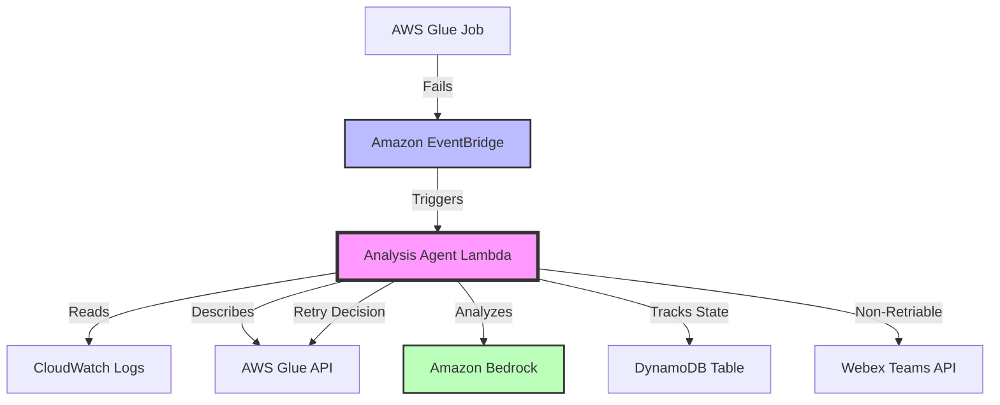
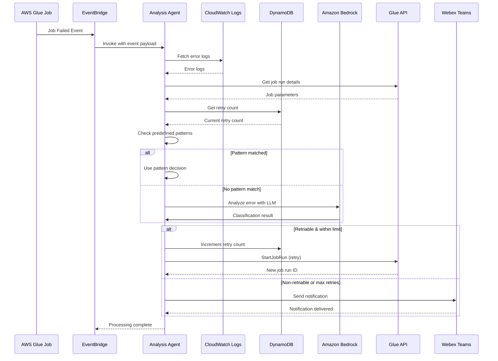

# Architecture Overview

This page provides a comprehensive overview of the Glue Job Retry Automation system architecture, explaining how all components work together to provide intelligent failure handling.

---

## 🏗️ High-Level Architecture



### Core Components

1. **AWS Glue Jobs** - Data processing jobs that may fail due to various reasons
2. **Amazon EventBridge** - Event-driven trigger that captures job state changes
3. **AWS Lambda** - Serverless compute that orchestrates the analysis and retry logic
4. **Amazon Bedrock** - AI service that provides intelligent error classification
5. **DynamoDB** - NoSQL database for tracking retry state
6. **CloudWatch Logs** - Centralized logging for error analysis
7. **Webex Teams** - Communication channel for non-retriable failure notifications

---

## 🔄 Component Interaction Flow

The following sequence diagram illustrates the complete interaction flow when a Glue job fails:



---

## 📦 Infrastructure Components

### 1. EventBridge Rule

**Resource**: `aws_cloudwatch_event_rule.glue_failure`

- **Purpose**: Monitors AWS Glue job state changes
- **Trigger**: Activates when job state changes to "FAILED"
- **Target**: Invokes the Lambda analysis function
- **Event Pattern**: Filters for Glue job failure events

[Learn more about EventBridge configuration →](eventbridge-rule.md)

### 2. Lambda Function

**Resource**: `aws_lambda_function.analysis_agent`

- **Runtime**: Python 3.11
- **Memory**: Configurable (default: 512 MB)
- **Timeout**: 5 minutes
- **Environment Variables**:
  - `WEBEX_WEBHOOK_URL`: Webex notification endpoint
  - `MAX_RETRY_COUNT`: Maximum retry attempts (default: 3)
  - `BEDROCK_MODEL_ID`: Bedrock model identifier
  - `DYNAMODB_TABLE`: Retry state table name

**Key Functions**:
- Event parsing and validation
- Log retrieval from CloudWatch
- Failure analysis coordination
- Retry decision making
- Job retry execution
- Notification sending

[Learn more about Lambda function →](lambda-function.md)

### 3. DynamoDB Table

**Resource**: `aws_dynamodb_table.retry_state`

- **Table Name**: `glue-retry-state`
- **Primary Key**: Composite key (job_name + original_run_id)
- **Billing Mode**: On-demand (auto-scaling)

**Schema**:
```
{
  "job_name": String (Partition Key),
  "original_run_id": String (Sort Key),
  "retry_count": Number,
  "last_retry_time": String (ISO 8601),
  "retry_history": List<Map>,
  "status": String
}
```

**Purpose**:
- Track retry attempts per job
- Prevent infinite retry loops
- Maintain failure history
- Enable retry analytics

### 4. IAM Roles and Policies

**Lambda Execution Role**: `glue-failure-analysis-lambda-role`

**Permissions**:
- **CloudWatch Logs**: Read log events, describe log streams
- **AWS Glue**: Get job run details, start job runs
- **DynamoDB**: Read and write to retry state table
- **Amazon Bedrock**: Invoke model for error analysis
- **CloudWatch Metrics**: Put custom metrics

**Security Principles**:
- Least privilege access
- Resource-specific permissions
- No wildcard (*) permissions
- Condition-based policies where applicable

### 5. CloudWatch Monitoring

**Log Groups**:
- `/aws/lambda/glue-failure-analysis-agent` - Lambda execution logs
- `/aws-glue/jobs/*` - Glue job logs (read access)

**Custom Metrics**:
- `FailureAnalysisCount` - Number of failures analyzed
- `RetryTriggeredCount` - Number of automatic retries
- `NotificationSentCount` - Number of notifications sent

**Alarms**:
- Lambda error rate alarm
- Lambda throttle alarm
- Lambda duration alarm

---

## 🔍 Data Flow

### 1. Failure Detection Flow

```
Glue Job Fails
    ↓
EventBridge captures state change
    ↓
Event pattern matches "FAILED" state
    ↓
Lambda function invoked with event payload
```

### 2. Analysis Flow

```
Lambda receives event
    ↓
Parse job details from event
    ↓
Fetch CloudWatch logs
    ↓
Get job parameters from Glue API
    ↓
Check DynamoDB for retry count
    ↓
Pattern matching → Matched? → Use pattern decision
    ↓ No match
Bedrock LLM analysis → Classification result
```

### 3. Decision Execution Flow

```
Analysis complete
    ↓
Retriable AND within retry limit? → Yes → Increment DynamoDB counter → Start new Glue job run
    ↓ No
Send Webex notification → Log outcome → Return success
```

---

[← Back to Documentation Home](index.md)
