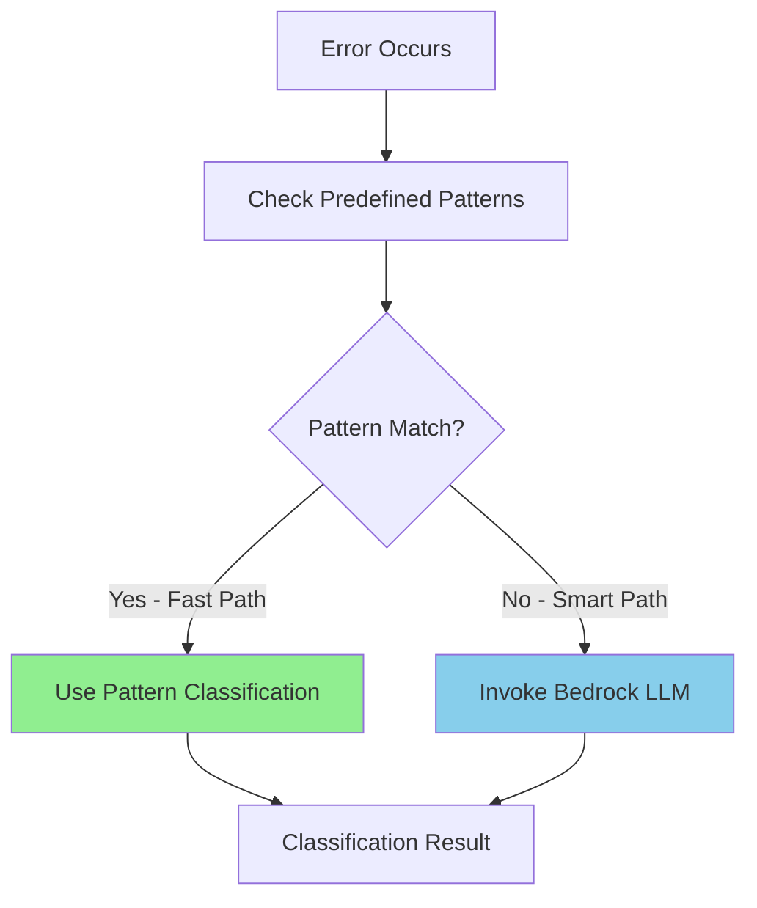

# Amazon Bedrock Integration

This page explains how Amazon Bedrock is integrated into the failure analysis workflow to provide intelligent, AI-powered error classification.

---

## 🎯 Overview

Amazon Bedrock provides the AI capabilities that enable the system to intelligently classify complex errors that don't match predefined patterns. By leveraging Large Language Models (LLMs), the system can understand context and nuance in error messages.

### Why Bedrock?

- **Intelligent Classification**: Understands complex error scenarios beyond simple pattern matching
- **Context Awareness**: Analyzes error messages in context of logs and job details
- **Confidence Scoring**: Provides confidence levels for classification decisions
- **Reasoning**: Explains why an error is classified as retriable or non-retriable
- **Adaptability**: Handles new error types without code changes

---

## 🧠 Two-Tier Analysis Strategy

The system uses a hierarchical approach to balance speed and intelligence:



### Tier 1: Pattern Matching (Fast Path)

**Speed**: ~50ms  
**Confidence**: 0.9 (high)  
**Cost**: Free

For common, well-understood errors like:
- Connection timeouts
- Network errors
- Schema mismatches
- Permission denied

### Tier 2: LLM Analysis (Smart Path)

**Speed**: ~2-5 seconds  
**Confidence**: Variable (0.5-0.95)  
**Cost**: ~$0.03 per analysis

For complex, nuanced errors that require understanding:
- Novel error patterns
- Context-dependent failures
- Multi-factor error scenarios
- Ambiguous error messages

---

## 🔧 Bedrock Client Implementation

### Client Initialization

```python
class BedrockClient(AWSClientWrapper):
    """Wrapper for Amazon Bedrock operations."""
    
    def __init__(self, model_id: str = "anthropic.claude-3-sonnet-20240229-v1:0"):
        super().__init__(max_retries=2)  # Fewer retries for LLM
        self.client = boto3.client('bedrock-runtime')
        self.model_id = model_id
```

### Supported Models

Currently configured for **Claude 3 Sonnet**:
- **Model ID**: `anthropic.claude-3-sonnet-20240229-v1:0`
- **Context Window**: 200K tokens
- **Speed**: Balanced performance and cost
- **Accuracy**: High for error classification tasks

Alternative models can be configured via environment variable:
```bash
BEDROCK_MODEL_ID=anthropic.claude-3-haiku-20240307-v1:0  # Faster, cheaper
BEDROCK_MODEL_ID=anthropic.claude-3-opus-20240229-v1:0   # More accurate, expensive
```

---

## 📝 Prompt Engineering

The prompt is carefully designed to extract structured, actionable insights from error analysis.

### Prompt Template

```python
prompt = f"""Analyze this AWS Glue job failure and determine if it's an intermittent issue that could succeed on retry.

Error Message: {error_message}

Error Logs:
{error_logs[:2000]}  # Limit log size

Classify this error as either:
1. RETRIABLE - Intermittent issues like network problems, timeouts, temporary service unavailability
2. NON_RETRIABLE - Persistent issues like code errors, data problems, permission issues

Respond in JSON format:
{{
    "classification": "RETRIABLE" or "NON_RETRIABLE",
    "confidence": 0.0 to 1.0,
    "reasoning": "brief explanation"
}}"""
```

### Prompt Design Principles

1. **Clear Instructions**: Explicitly states the classification task
2. **Context Provided**: Includes both error message and logs
3. **Structured Output**: Requests JSON format for easy parsing
4. **Confidence Scoring**: Asks for confidence level
5. **Reasoning Required**: Ensures explainable decisions
6. **Binary Classification**: Simplifies decision making (RETRIABLE vs NON_RETRIABLE)

### Log Size Limitation

Error logs are truncated to 2000 characters to:
- Stay within token limits
- Reduce API costs
- Focus on recent, relevant errors
- Maintain fast response times

---

## 🔄 LLM Invocation Process

### Step-by-Step Flow

```python
def analyze_error(self, error_message: str, error_logs: str) -> Dict[str, Any]:
    """Analyze error using Bedrock LLM."""
    
    # 1. Build the request body
    body = json.dumps({
        "anthropic_version": "bedrock-2023-05-31",
        "max_tokens": 500,
        "messages": [
            {
                "role": "user",
                "content": prompt
            }
        ]
    })
    
    # 2. Invoke the model with retry logic
    response = self.client.invoke_model(
        modelId=self.model_id,
        body=body
    )
    
    # 3. Parse the response
    response_body = json.loads(response['body'].read())
    content = response_body.get('content', [{}])[0].get('text', '{}')
    
    # 4. Extract structured result
    result = json.loads(content)
    
    return {
        "classification": result.get("classification", "NON_RETRIABLE"),
        "confidence": float(result.get("confidence", 0.5)),
        "reasoning": result.get("reasoning", "Unable to determine")
    }
```

### Request Parameters

- **`anthropic_version`**: API version for Claude models
- **`max_tokens`**: Limits response length (500 tokens = ~375 words)
- **`messages`**: Conversation format required by Claude

---

## 📊 Response Processing

### Expected Response Format

```json
{
  "classification": "RETRIABLE",
  "confidence": 0.85,
  "reasoning": "The error indicates a connection timeout to the S3 endpoint, which is a transient network issue that typically resolves on retry."
}
```

### Field Descriptions

| Field | Type | Range | Description |
|-------|------|-------|-------------|
| **classification** | String | RETRIABLE, NON_RETRIABLE | Binary classification result |
| **confidence** | Float | 0.0 - 1.0 | Model's confidence in the classification |
| **reasoning** | String | N/A | Human-readable explanation |

### Confidence Interpretation

- **0.9 - 1.0**: Very confident - Clear, unambiguous error
- **0.7 - 0.89**: Confident - Standard error pattern recognized
- **0.5 - 0.69**: Moderate - Some ambiguity in error context
- **0.0 - 0.49**: Low confidence - Unclear or contradictory signals

---

## 🛡️ Error Handling & Fallbacks

### Robust Error Handling

```python
try:
    response = self._retry_with_backoff(_invoke_model)
    # Parse and return result
except Exception as e:
    logger.error(f"Failed to analyze error with Bedrock: {str(e)}")
    # Return conservative default
    return {
        "classification": "NON_RETRIABLE",
        "confidence": 0.0,
        "reasoning": f"LLM analysis failed: {str(e)}"
    }
```

### Fallback Strategy

If Bedrock analysis fails:
1. **Conservative Classification**: Defaults to NON_RETRIABLE
2. **Zero Confidence**: Signals analysis uncertainty
3. **Error Context**: Includes failure reason in reasoning
4. **Notification Triggered**: Ensures human review of the failure

This "fail-safe" approach prevents:
- Infinite retry loops on LLM failures
- Silent failures in the automation
- Unnecessary costs from repeated failed LLM calls

---

## 💡 Example Classifications

### Example 1: Network Timeout (Retriable)

**Input**:
```
Error: SocketTimeoutException: Read timed out while connecting to S3 bucket
```

**Bedrock Response**:
```json
{
  "classification": "RETRIABLE",
  "confidence": 0.95,
  "reasoning": "Socket timeout is a classic transient network issue. S3 is highly available, and this is likely temporary network congestion."
}
```

### Example 2: Schema Error (Non-Retriable)

**Input**:
```
Error: AnalysisException: cannot resolve 'customer_id' given input columns: [id, name, email]
```

**Bedrock Response**:
```json
{
  "classification": "NON_RETRIABLE",
  "confidence": 0.98,
  "reasoning": "This is a schema mismatch error indicating the code references a column that doesn't exist in the data. Requires code or data schema fix."
}
```

### Example 3: Ambiguous Error (Moderate Confidence)

**Input**:
```
Error: Job failed with unknown error
```

**Bedrock Response**:
```json
{
  "classification": "NON_RETRIABLE",
  "confidence": 0.55,
  "reasoning": "Error message is too vague to determine root cause. Requires manual investigation of full logs."
}
```

---

## 🔐 IAM Permissions Required

The Lambda function needs Bedrock permissions:

```json
{
  "Effect": "Allow",
  "Action": [
    "bedrock:InvokeModel"
  ],
  "Resource": "arn:aws:bedrock:*::foundation-model/anthropic.claude-3-sonnet-20240229-v1:0"
}
```

---

## 💰 Cost Optimization

### Cost Breakdown

- **Input Tokens**: ~300 tokens per analysis (error message + logs)
- **Output Tokens**: ~50 tokens (JSON response)
- **Cost per Analysis**: ~$0.003 (Claude 3 Sonnet pricing)

### Optimization Strategies

1. **Pattern Matching First**: Most errors (~70%) handled by patterns, avoiding LLM costs
2. **Log Truncation**: Limit logs to 2000 characters
3. **Token Limits**: Max 500 output tokens
4. **Retry Limits**: Only 2 retry attempts for LLM calls
5. **Caching Considered**: Future enhancement to cache common error analyses

**Estimated Monthly Cost**: $3-5 for 100 failures (assuming 30% use LLM)

---

[← Back: Lambda Function](lambda-function.md) | [Documentation Home](index.md)
